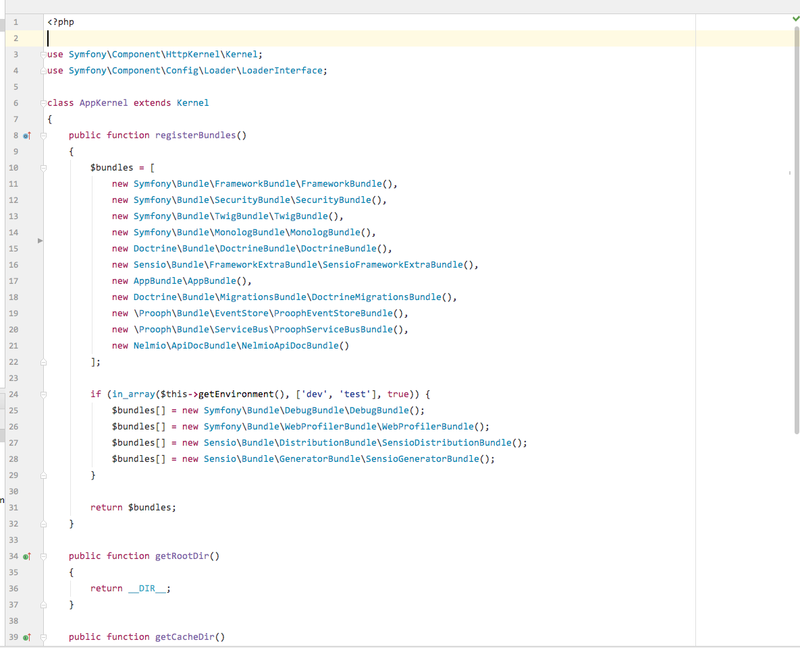
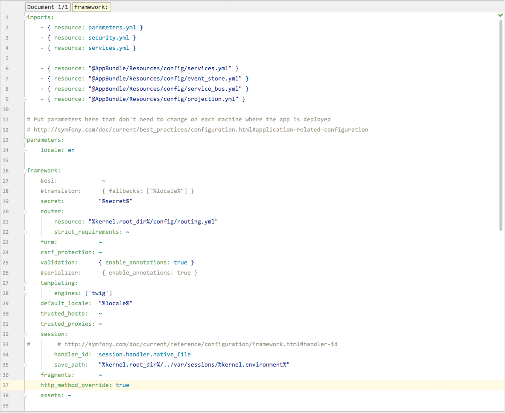
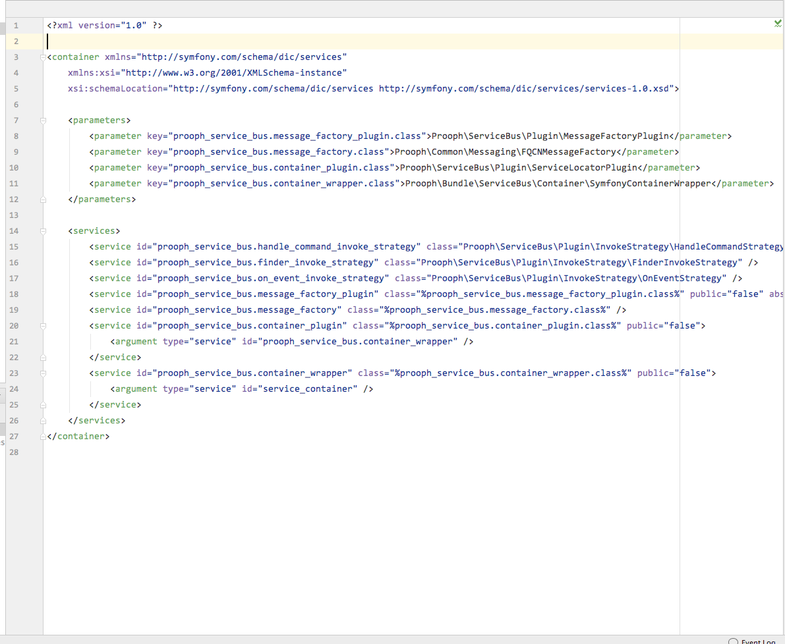

# PhpStorm GitHub Theme

This is a PhpStorm theme incorporating GitHub inspired colours and syntax highlighting, and slightly enlargened font size and line spacing. Matching the GitHub style exactly seems to be impossible, as PhpStorm won't differentiate between some properties the same as GitHub does, but for the most part PHP, XML, and YAML are the same.

### About this theme

This theme builds upon https://github.com/Gynidark/PHPStorm-ThemeGithub and uses the Consolas font mentioned in this repository https://github.com/panique/phpstorm-theme-github-remixed. The PhpStorm-ThemeGithub theme had old styles for XML and YAML, and the PHP highlighting wasn't quite as close as I'd have liked it, so I modified those to be a little more representative of GitHub's.

### Installation

* Copy the contents of the .icls file in this repo and save it to your PhpStorm's 'colors' directory (if the 'colors' directory doesn't exist, create it), eg on Mac:

```
~/Library/Preferences/PhpStorm2016.2/colors/GitHub.icls
```

Older versions of PhpStorm (prior to Year.Release version numbers) will be in a location like:

```
~/Library/Preferences/WebIde[version number]/colors/GitHub.icls
```

Windows will, apparently, be somewhere like this:

```
C:\Users\[Username]\.PhpStorm\config\colors
```

* If you have PhpStorm open, restart it
* Go to Preferences -> Editor -> Colors & Fonts, then select 'GitHub' in the 'Scheme' dropdown


### Consolas Font

Windows users should have the consolas font already. Mac users (and possibly Linux?) follow this guide: http://ikato.com/blog/how-to-install-consolas-font-on-mac-os-x.html


### Screenshots

#### PHP




#### YAML




#### XML


